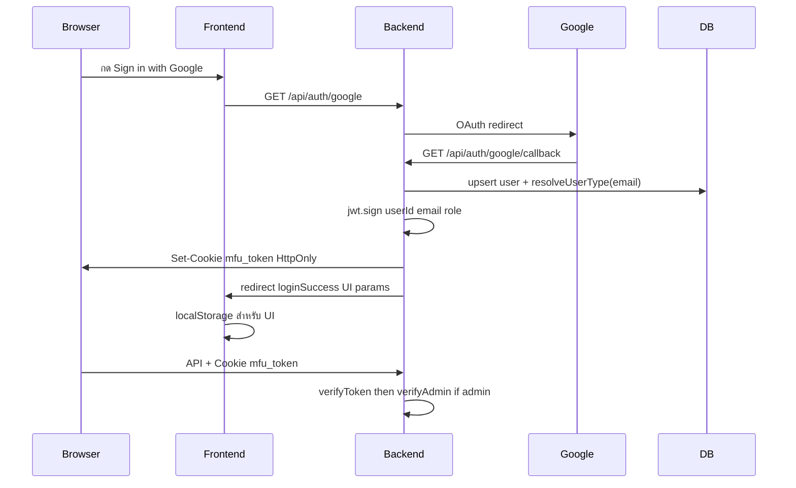

# Demo Security — Authentication & Authorization

**โครงการ:** MFU Space Booking  
**อัปเดตล่าสุด:** 2026-09-06  
**จุดประสงค์:** สคริปต์และโน้ตอธิบาย AuthN/AuthZ ตามระบบที่ใช้งานจริง สำหรับ Demo หน้าอาจารย์

---

## 1. AuthN vs AuthZ (พูดสั้น ๆ ก่อนโชว์)

| คำ | ความหมายในโปรเจกต์นี้ |
|----|----------------------|
| **Authentication (ยืนยันตัวตน)** | ระบบรู้ว่า “คุณคือใคร” — ผ่าน Google OAuth แล้ว Backend ออก JWT |
| **Authorization (สิทธิ์)** | ระบบรู้ว่า “คุณทำอะไรได้” — จาก `role` ใน JWT (`admin` / `internal` / `external`) |

**แหล่งความจริง (Source of Truth):** JWT ใน cookie `mfu_token` ที่ Backend ตรวจด้วย `verifyToken` / `verifyAdmin`  
**localStorage:** ใช้แสดง UI / กันหน้า route เท่านั้น — **ไม่ใช่** สิทธิ์จริง

---

## 2. Token เดินทางจากไหนไปไหน

### จุดที่ต้องพูดชัด

1. **ออก Token ที่ไหน?**  
   Backend หลัง Google callback สำเร็จ (`backend/src/routes/auth.routes.ts`)  
   Payload: `{ userId, email, role, name }` หมดอายุ 8 ชั่วโมง

2. **ส่ง Token ไปเก็บที่ไหน?**  
   ใส่ใน HTTP cookie ชื่อ `mfu_token`  
   - `httpOnly: true` → JavaScript อ่านไม่ได้ (กัน XSS ขโมย token)  
   - `sameSite: lax`  
   - `secure: true` เมื่อ HTTPS / `false` บน localhost HTTP

3. **Request ถัดไปส่ง Token ยังไง?**  
   Browser ส่ง cookie อัตโนมัติไปที่ `/api/*` (Frontend ใช้ `axios` + `withCredentials: true`)  
   Middleware `verifyToken` อ่านจาก cookie (หรือ `Authorization: Bearer` สำหรับทดสอบ API)

4. **Frontend ส่ง role ใน URL หลัง login ทำไม?**  
   เพื่อเติม localStorage ให้ UI รู้ว่าจะไป `/admin` หรือ `/home` — **API ไม่เชื่อค่านี้**

---

## 3. Authorization — ใครทำอะไรได้

### 3.1 กำหนด Role จากอีเมล (`resolveUserType`)

| อีเมล | Role |
|--------|------|
| `@property.mfu.ac.th` | `admin` |
| `@mfu.ac.th` | `internal` |
| อื่นๆ | `external` |
| อยู่ใน `DEV_ADMIN_EMAILS` | `admin` (UAT เท่านั้น) |

### 3.2 ชั้นป้องกัน

| ชั้น | ไฟล์ | ทำอะไร |
|------|------|--------|
| Frontend route guard | `frontend/src/router/index.ts` | กันไม่ให้เปิดหน้า `/admin/*` ถ้า localStorage ไม่ใช่ admin |
| API Authentication | `verifyToken` | ไม่มี/token เสีย → **401** |
| API Authorization (Admin) | `verifyAdmin` | ไม่ใช่ admin → **403** |
| Ownership (anti-IDOR) | `user.routes` / `payment.routes` / `booking.routes` | ใช้ `req.user.userId` / `email` จาก JWT เท่านั้น |

### 3.3 ตัวอย่างที่โชว์ได้

| สถานการณ์ | ผลลัพธ์ |
|-----------|---------|
| ไม่ login เรียก `POST /api/bookings` | **401** |
| User ทั่วไปเปิด `/admin/dashboard` | เด้งไป `/home` (UI) |
| User ทั่วไปเรียก `GET /api/admin/bookings` | **403** |
| User A เรียก `GET /api/user/bookings/{id ของ B}` | **403** |
| สร้างจองพร้อม `userId` ของคนอื่นใน body | Backend บังคับเป็น userId จาก JWT |

---

## 4. สคริปต์ Demo (แนะนำ 5–8 นาที)

**เตรียม:** Docker ที่ http://localhost:8080 หรือ `npm run dev`  
บัญชี Google อยู่ใน `DEV_ADMIN_EMAILS` สำหรับโชว์ admin

### ขั้นที่ 1 — Authentication

1. เปิดหน้า Login → กด **Sign in with Google**
2. หลังกลับมาสำเร็จ เปิด DevTools → **Application → Cookies**
3. ชี้ cookie `mfu_token` (HttpOnly) — อธิบายว่านี่คือ JWT
4. ชี้ **localStorage** (`isLoggedIn`, `userRole`) — บอกว่าเป็น UI เท่านั้น

### ขั้นที่ 2 — API ใช้ Token อย่างไร

1. DevTools → Network → เรียกหน้า Dashboard / รีเฟรช
2. ดู request ไป `/api/user/profile` หรือ `/api/user/bookings/...`
3. ชี้ว่ามี Cookie `mfu_token` ส่งไปด้วย (ไม่ต้องใส่ Bearer ใน UI จริง)

### ขั้นที่ 3 — ไม่มี Token = ไม่เข้า

1. (ทางเลือก) ใช้ Incognito หรือลบ cookie แล้วเรียก API ที่ต้อง auth  
   หรืออธิบายจาก unit/integration test: ไม่มี token → **401**

### ขั้นที่ 4 — Authorization (Admin)

1. Login ด้วยบัญชี **ไม่ใช่** admin → พยายามเข้า `/admin/dashboard` → ถูกเด้ง
2. Login ด้วยบัญชี admin → เข้า Admin ได้
3. (ทางเลือก Postman/curl) ส่ง JWT ของ internal ไป `GET /api/admin/bookings` → **403**

### ขั้นที่ 5 — Ownership (anti-IDOR)

1. อธิบายสั้น ๆ: แม้ login แล้ว ก็ดูจองของคนอื่นไม่ได้  
2. อ้างอิง test `authz_idor.test.ts` หรือโชว์ 403 เมื่อเรียก bookings ของ userId คนอื่น

### ขั้นที่ 6 — Logout

1. กดออกจากระบบ → `POST /api/auth/logout` ลบ cookie + ล้าง localStorage

---

## 5. ประโยคพูดสั้น ๆ (Talking points)

> “ระบบใช้ **Google OAuth** เพื่อ Authentication หลังจาก Google ยืนยันตัวตนแล้ว Backend จะสร้าง **JWT** และส่งกลับไปยัง Browser ในรูป **HttpOnly cookie** ชื่อ `mfu_token`  
> ทุกครั้งที่เรียก API ที่ต้อง login เบราว์เซอร์จะส่ง cookie นี้กลับมาให้ Backend ตรวจด้วย `verifyToken`  
> ส่วน Authorization ใช้ **role ใน JWT** ที่ได้จากโดเมนอีเมล — Admin API ต้องผ่าน `verifyAdmin` ด้วย  
> ข้อมูลใน localStorage ใช้แค่ควบคุมหน้าจอ ไม่ใช่สิทธิ์จริง และเมื่อเข้าถึงข้อมูลของผู้ใช้ ระบบยึด `userId` จาก Token ไม่เชื่อค่าที่ client ส่งมา”

---

## 6. ข้อจำกัดที่ควรบอกตรง ๆ (ถ้าถูกถาม)

- Payment webhook ของ gateway บางตัวเปิดรับจากภายนอก (มาตรฐานของ provider) — ไม่ใช่ user session API
- ไฟล์ใน `/uploads` เข้าถึงได้ถ้ามี URL — ควรไม่แชร์ลิงก์สาธารณะ
- `DEV_ADMIN_EMAILS` สำหรับ UAT — production จริงควรปิด

---

## 7. ไฟล์โค้ดอ้างอิง

| หัวข้อ | ไฟล์ |
|--------|------|
| OAuth + ออก JWT cookie | `backend/src/routes/auth.routes.ts` |
| verifyToken / verifyAdmin | `backend/src/middleware/auth.ts` |
| Role จากอีเมล | `backend/src/utils/resolveUserType.ts` |
| Ownership โปรไฟล์/จอง | `backend/src/routes/user.routes.ts` |
| บังคับ userId จาก JWT ตอนจอง | `backend/src/routes/booking.routes.ts` |
| Ownership ชำระเงิน | `backend/src/routes/payment.routes.ts` |
| UI guard | `frontend/src/router/index.ts` |
| Tests AuthZ | `backend/src/__tests__/authz_idor.test.ts` |
| Checklist ความปลอดภัย | `docs/SECURITY_CHECKLIST.md` |
